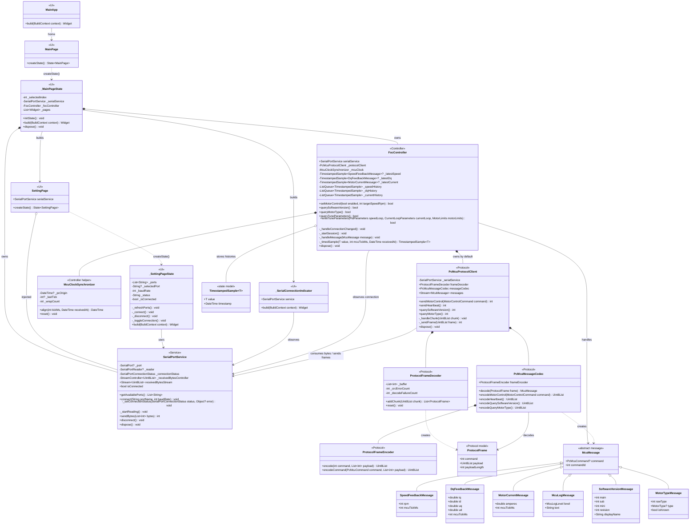
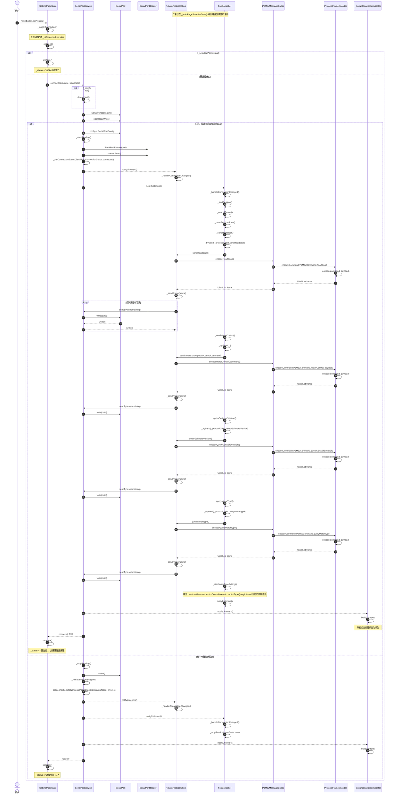
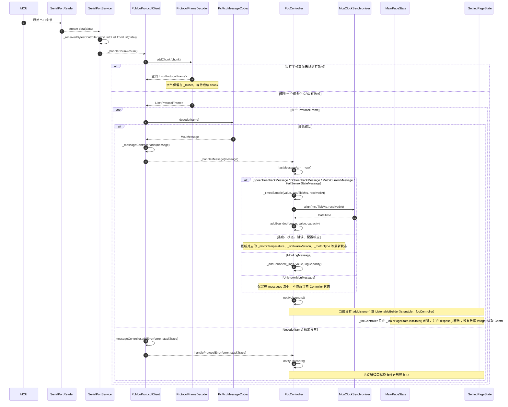

# foc_studio 代码结构与 UML

本文档依据当前 `lib/` 源代码整理。图中省略了 Flutter 布局控件、窗口管理器等与串口业务无关的框架细节；类名、字段名和方法名均沿用源代码。

## 1. UML 类图

### 类图说明

1. **UI 层**由 `MainApp`、`MainPage`、`_MainPageState`、`SettingPage`、`_SettingPageState` 和 `_SerialConnectionIndicator` 组成。`_MainPageState` 是顶层对象生命周期的所有者：它创建同一个 `SerialPortService` 和 `FocController`，把 `SerialPortService` 注入 `SettingPage`，并在退出时按 `FocController.dispose()`、`SerialPortService.dispose()` 的顺序释放资源。`_SettingPageState` 只负责串口扫描、选择、连接/断开操作及状态文字；`_SerialConnectionIndicator` 只展示连接状态。
2. **Service 层**的核心是 `SerialPortService`。它只处理串口枚举、打开和配置、创建读取器、收发原始字节、连接状态以及资源释放，不解释任何 PC-MCU 命令。`receivedBytesStream` 是 Service 层向上提供的原始字节边界。
3. **协议层**以 `PcMcuProtocolClient` 为门面。它是 `receivedBytesStream` 的唯一协议消费者：`ProtocolFrameDecoder` 负责拆包、粘包、帧头同步和 CRC 校验；`PcMcuMessageCodec` 负责把 `ProtocolFrame` 转换成强类型 `McuMessage`，或把下行命令交给 `ProtocolFrameEncoder` 编码。图中只展开了对主流程最有代表性的消息子类，其余温度、错误码、传感器和参数响应类遵循相同继承关系。
4. **Controller 层**的 `FocController` 负责一次通信会话的业务策略，包括心跳、周期电机控制、电机类型轮询、配置查询、最新状态和有限长度的遥测历史。带 MCU tick 的消息会经 `_timedSample()` 和 `McuClockSynchronizer.align()` 映射到 PC 时间。
5. 当前依赖方向清晰：UI 调用 Service；协议客户端消费 Service 的字节流；Controller 订阅协议消息并整理成 UI 可读状态。需要特别注意的是，`_MainPageState` 虽然持有 `_focController`，但当前只创建和释放它，没有把它传给任何数据页面，也没有用它驱动 UI。

## 2. UML 时序图：用户点击“连接”后的完整调用流程

### 连接时序说明

1. UI 入口是连接按钮的 `onPressed`，它调用 `_toggleConnection()`；在未连接状态下继续进入 `_connect()`。页面仅校验选择项、调用 Service，并用 `setState()` 更新本地提示文字。
2. `SerialPortService.connect()` 完成真正的硬件工作：创建 `SerialPort`、执行 `openReadWrite()`、应用 8N1/无流控配置，并由 `_startReading()` 创建 `SerialPortReader` 和数据流订阅。只有这些步骤全部成功后，才调用 `_setConnectionStatus(SerialPortConnectionStatus.connected)`。
3. 连接状态通过 `notifyListeners()` 同步通知多个观察者。`PcMcuProtocolClient._handleConnectionChanged()` 记录会话是否连接；`FocController._handleConnectionChanged()` 调用 `_startSession()`；导航栏的监听最终触发 `_SerialConnectionIndicator.build()`，显示绿色连接状态。
4. `_startSession()` 不只是设置标志，它会立即发送心跳、当前电机控制命令、软件版本查询和电机类型查询。每条命令均经过 `PcMcuMessageCodec`、`ProtocolFrameEncoder`、`PcMcuProtocolClient._sendFrame()`、`SerialPortService.sendBytes()`，最终到 `SerialPort.write()`。随后启动 1 秒心跳、500 毫秒电机控制和 1 秒电机类型查询周期任务。
5. `PcMcuProtocolClient._sendFrame()` 用循环处理串口短写，直到完整帧发完；图中对第一条心跳完整展开，其余三条使用同一发送通道。
6. 任一打开、配置或读取初始化步骤失败时，Service 负责停止读取、关闭/释放端口、切换到 `failed` 并重新抛出异常；Controller 停止会话，UI 捕获异常并显示“连接失败”。这体现了分工：UI 决定显示什么，Service 决定底层连接是否成立。

## 3. UML 时序图：串口收到数据后的实际处理链路

> 重要：当前源代码不存在“最终由 UI 显示遥测数据”的完整链路。下面的图严格展示实际代码：数据处理到 `FocController.notifyListeners()` 为止；现有 UI 没有订阅 `FocController`，因此不会因收到数据而重建或显示 `latestSpeed`、`latestDq`、`latestCurrent`、`logs` 等内容。

### 接收时序说明

1. `SerialPortReader` 产生的每次 `data` 只是任意大小的字节块，不保证正好是一帧。`SerialPortService` 复制该字节块并写入 `_receivedBytesController`；它仍然不理解业务协议。
2. `PcMcuProtocolClient._handleChunk()` 把字节交给 `ProtocolFrameDecoder.addChunk()`。Decoder 持有跨回调的 `_buffer`，所以能处理半帧、粘包、前导乱码和 CRC 错误；只有帧头、长度和 CRC 均合法时才产生 `ProtocolFrame`。
3. `PcMcuMessageCodec.decode()` 根据 `PcMcuCommand`、Big Endian 字段布局和缩放规则创建具体的 `McuMessage`。成功结果经 `_messageController` 广播；格式异常则经 `addError()` 进入 `FocController._handleProtocolError()`，但协议错误不会直接断开串口。
4. `FocController._handleMessage()` 把消息整理成适合展示的状态。转速、DQ、电流和霍尔消息会通过 `_timedSample()` 调用 `McuClockSynchronizer.align()`，再由 `_addBounded()` 写入有限长度历史；温度、错误码和配置响应更新各自的最新值；日志进入 `_logs`。处理完成后统一调用 `notifyListeners()`。
5. **实际断点在 UI 层。** `_MainPageState` 创建了 `_focController`，但 `_pages` 中目前只有三个静态 `Text` 占位页和 `SettingPage`；没有页面接收 `FocController`，也没有 `ListenableBuilder` 监听它。现有唯一的 `ListenableBuilder` 监听的是 `SerialPortService`，因此它只能更新连接图标，不能显示收到的 MCU 数据。
6. 要闭合该链路，UI 层需要让真实数据页面获得同一个 `FocController`，通过 `ListenableBuilder(listenable: controller, ...)` 或等价监听方式触发其 `build()`，并读取 `latestSpeed`、`latestDq`、`latestCurrent`、`motorTemperature`、`logs` 等 getter。该步骤是建议的后续设计，不是当前源码中已经存在的调用。

## UI 层与 Service 层职责总结

| 层 | 当前负责 | 不应负责 |
|---|---|---|
| UI 层 | 导航、串口选择、用户点击事件、连接状态和错误文字展示；未来还应监听 `FocController` 并把结构化状态渲染为控件或图表 | 直接打开串口、拼协议帧、计算 CRC、解析二进制 payload、管理心跳定时器 |
| Service 层 | 枚举端口、打开/配置/关闭串口、创建读取器、收发原始字节、报告连接/传输状态、释放资源 | 识别 PC-MCU 命令、解析遥测数据、决定电机控制业务策略、直接构建 Widget |
| 协议层 | 字节组帧与校验、命令编解码、强类型消息流、完整帧发送 | 页面布局、串口生命周期策略、遥测展示形式 |
| Controller 层 | 会话策略、周期命令、配置读写、消息状态归并、时间对齐、历史缓存、通知 UI | 直接操作 Flutter 控件或底层 `SerialPort` |
