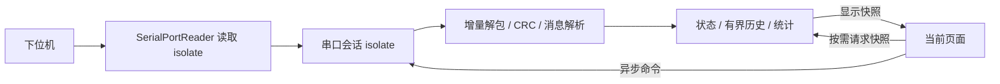

# 串口执行与 UI 更新

`MainPage` 持有 UI 代理 `SerialPortService`。代理启动一个常驻的
`serial-session` isolate；页面切换不创建或销毁串口会话。

- `SerialTransport`、`PcMcuProtocolClient`、`FocSession` 和统计累加器均在串口
  会话 isolate 内创建。原始字节不会经过 UI 转发；心跳、周期控制和电机类型查询
  也由后台定时器执行。
- 解包器跨接收块保留半帧，使用读取游标消费数据，每块结束时只压缩一次缓冲区。
  CRC 直接读取索引范围，避免逐帧复制校验输入。
- 所有完整消息都会更新后台状态和有界历史，即使 UI 没有监听者。
  当前历史容量为每种遥测 1200 条、日志 500 条。
- `FocController` 仅展示快照并转发操作。有可见组件监听时最多每 50 ms 请求一次，
  状态未改变则不更新。统计面板每秒读取一次；后台速率采样独立运行。
  同类请求最多一个在途，UI 忙碌时不会积压周期快照。
- 当前 `MainPage` 只挂载选中页面。设置页卸载时停止统计快照请求，重新进入时
  立即请求后台累计值。后续页面也应在可见期间订阅控制器，避免保活隐藏订阅。
- 扫描、连接、断开和控制操作现在是异步接口。设置页禁用进行中的操作并检查
  `mounted`，防止切页后收到异步结果触发 `setState`。
- 发送使用有序队列。非阻塞写返回 0 时保存偏移并稍后重试；一帧完整写入系统
  缓冲区后才累计发送帧数。控制操作返回成功表示已进入发送队列，不代表 MCU 已确认。
- 断开连接时清除半帧、待发送队列和业务状态；统计累计值保留到下次连接。
  服务关闭会释放会话；后台异常退出会显式上报失败并结束待完成请求。
